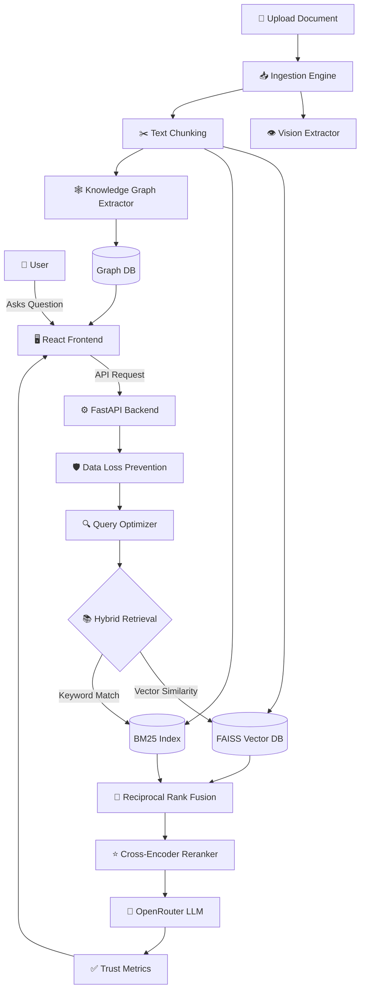

<div align="center">
  
  
  
  
  
  <br/><br/>

  <h1 align="center">Doc-Pilot AI</h1>
  <p align="center">
    <strong>An Enterprise-Grade, Agentic RAG Platform for Deep Document Intelligence</strong>
  </p>
</div>

---

## 🌟 Overview

**Doc-Pilot-AI** is a full-stack, AI-powered Enterprise Knowledge Assistant designed to ingest, process, and query internal company documents with extreme accuracy. Moving far beyond a simple wrapper, Doc-Pilot-AI implements an advanced **Agentic RAG Pipeline** featuring hybrid search, semantic reranking, real-time knowledge graph extraction, and strict data loss prevention (DLP) protocols.

Whether you're uploading technical PDFs, querying code documentation, or exploring entity relationships via the interactive visualizer, Doc-Pilot-AI ensures responses are fully grounded, highly secure, and blazingly fast.

---

## 🏗️ System Architecture

The architecture is divided into a robust **FastAPI backend** and a highly interactive **React + Vite frontend**.



---

## ✨ Key Features & Capabilities

### 🔍 Advanced Retrieval (RAG)
*   **Hybrid Search Engine:** Combines **FAISS** (Dense Vector Semantic Search) and **BM25** (Sparse Keyword Search) using Reciprocal Rank Fusion (RRF) for unparalleled document retrieval accuracy.
*   **Cross-Encoder Reranking:** Filters and re-orders retrieved chunks to ensure the LLM only sees the most highly relevant context.
*   **Query Optimization:** Automatically rewrites and expands vague user queries into highly descriptive search vectors.

### 🤖 Multi-Agent Ecosystem
*   **Memory Agent:** Persists chat history safely via Supabase for continuous conversational context.
*   **Vision Agent:** Automatically extracts text and context from images and charts embedded within uploaded PDFs.
*   **Data Agent:** Specialized in interpreting tabular data and structured formats.

### 🛡️ Enterprise Security & Trust
*   **Data Loss Prevention (DLP):** Automatically detects and redacts Personally Identifiable Information (PII) before it ever touches an external LLM.
*   **Trust Metrics:** Every generated answer is scored for confidence, relevance, and hallucination probability.
*   **Ghost Mode:** An incognito mode that instantly disables chat logging and memory persistence for highly sensitive queries.

### 🕸️ Interactive Visualizations
*   **Dynamic Knowledge Graph:** Automatically extracts entities and relationships from your documents and visualizes them using an interactive `ForceGraph2D` engine.
*   **Customizable Themes:** Switch effortlessly between light mode, dark mode, and stunning visual styles like **Neon Cyberpunk** or **Sankey Data Flows**.

---

## 🛠️ Technology Stack

| Layer | Technologies Used |
| :--- | :--- |
| **Frontend** | React, Vite, Lucide-React, Recharts, React-Force-Graph |
| **Backend** | Python, FastAPI, Uvicorn |
| **AI & NLP** | OpenRouter, Sentence-Transformers, Cross-Encoders |
| **Databases** | Supabase (PostgreSQL), FAISS, MLFlow, Local JSON stores |

---

## 🚀 Getting Started

### 1. Clone the Repository
```bash
git clone https://github.com/abdullatheefmm/Doc-Pilot-AI.git
cd Doc-Pilot-AI
```

### 2. Backend Setup
Navigate to the `Backend` directory, set up your Python environment, and start the server:
```bash
cd Backend
python -m venv .venv
source .venv/bin/activate  # Or `.venv\Scripts\activate` on Windows
pip install -r requirements.txt

# Start the FastAPI Server
python main.py
```

### 3. Frontend Setup
Open a new terminal, navigate to the `frontend` directory, and start the development server:
```bash
cd frontend
npm install
npm run dev
```

### 4. Environment Variables
Ensure you have a `.env` file at the root of your project with the following required keys:
```env
OPENROUTER_API_KEY=your_openrouter_api_key
SUPABASE_URL=your_supabase_url
SUPABASE_KEY=your_supabase_anon_key
```

---

## 🔒 License & Usage
This project is built for enterprise-grade knowledge extraction and retrieval. Please ensure you comply with your organization's data privacy policies before deploying to production environments.

> [!TIP]
> **Pro Tip:** Toggle **Ghost Mode** in the frontend sidebar whenever querying internal HR or financial documents to ensure zero logging!
